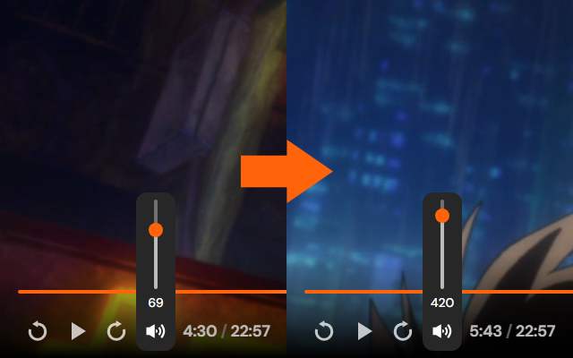

# Crunchyroll Volume Boost

A browser extension that extends Crunchyroll's player volume control from 100% to 600%.

## How it works

Integrates directly with the existing volume control rather than an entirely separate one, using the top third of the slider to go from 100% to 600%.

From 0% to 100%, the player behaves normally. Above 100%, the extension uses the Web Audio API to apply additional amplification. The extension also applies dynamic range compression to reduce clipping and harsh distortion.

Only your selected volume is saved locally, so you don't have to reapply it between episodes or binge sessions. No data is sent to the developer or any third party. See the [Privacy Policy](PRIVACY.md) for details.

## License

Licensed under the [MIT License](LICENSE.md).

This is an unofficial project and is not affiliated with or endorsed by Crunchyroll.

## Credits

This project was partially coded and refactored with the help of generative AI (OpenAI's GPT-5.6)
